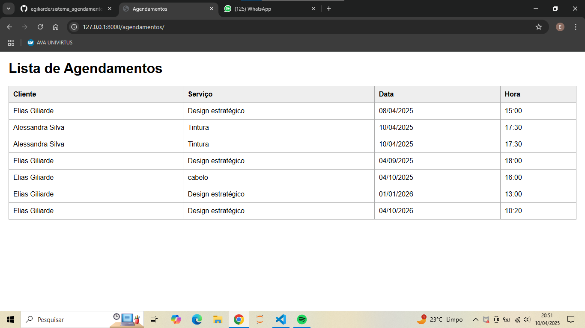

# Sistema de Agendamento para Clínica de Estética

Este projeto é um sistema de agendamento online desenvolvido com Django para facilitar o gerenciamento de horários de clientes em clínicas de estética.
---
## Tecnologias utilizadas
- Python
- Django
- SQLite (ou PostgreSQL, se estiver usando)
- HTML/CSS
---
## Como rodar localmente

1. Clone o repositório:

git clone https://github.com/egiliarde/sistema_agendamento_clinica.git

2. Crie um ambiente virtual:

3. Ative o ambiente:
- Windows: venv\Scripts\activate
- Linux/macOS: source venv/bin/activate

4. Instale as dependências:

pip install -r requirements.txt

5. Rode o projeto:

python manage.py runserver
---
## Prints da interface

---